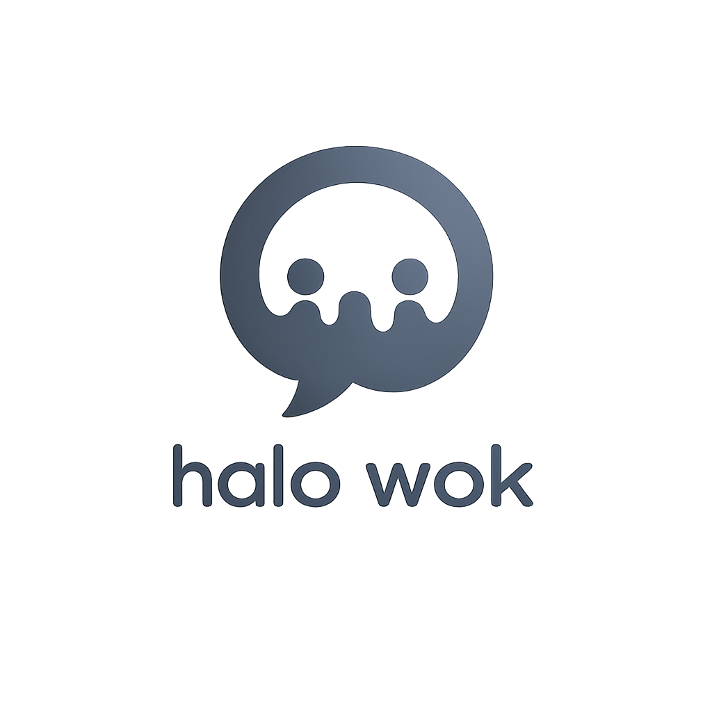

<div align="center">
  
  <br><br>
  <p><strong>Real-time chat that snaps, crackles, and pops.</strong></p>

  [](https://www.typescriptlang.org)
  [](https://react.dev)
  [](https://vitejs.dev)
  [](https://tailwindcss.com)
  [](https://socket.io)
  [](https://threejs.org)

  <br>
  <a href="#-features">Features</a> •
  <a href="#-tech-stack">Stack</a> •
  <a href="#-quick-start">Quick Start</a> •
  <a href="#-project-structure">Structure</a> •
  <a href="#-environment">Env</a>
</div>

---

## ✨ Features

| | | |
|---|---|---|
| 💬 **Real‑time messaging** | Direct messages & group chats powered by Socket.IO | ✅ |
| 👥 **Friends system** | Add friends, manage requests, search users, block/unblock | ✅ |
| 🏘️ **Group chats** | Create public/private groups, manage members & roles | ✅ |
| 🎨 **Animated background** | Three.js GLSL ring shader — mouse parallax, click burst | ✅ |
| 🔐 **Auth** | Email/password + Google & Facebook OAuth | ✅ |
| 🎭 **User profiles** | Avatar, bio, status, last seen — full customization | ✅ |
| ⚙️ **Settings hub** | General, notifications, privacy, appearance (dark mode), account, blocked users | ✅ |
| 📎 **File sharing** | Drag‑and‑drop uploads with preview | ✅ |
| 🔍 **Message search** | Search within conversations with match navigation | ✅ |
| 📌 **Pinned messages** | Pin/unpin important messages in any chat | ✅ |
| 👀 **Typing indicators** | See who's typing in real-time | ✅ |
| ✅ **Read receipts** | Know when your message has been read | ✅ |
| ↔️ **Forward messages** | Forward messages between chats | ✅ |
| 🎬 **Animations** | Framer Motion throughout — smooth as butter | ✅ |

---

## 🧱 Tech Stack

<table>
<tr>
  <th>Category</th>
  <th>Libraries</th>
</tr>
<tr>
  <td>Core</td>
  <td>React 19 · TypeScript 6 · Vite 8 · React Router 7</td>
</tr>
<tr>
  <td>Styling</td>
  <td>Tailwind CSS 4 · class-variance-authority · tailwind-merge</td>
</tr>
<tr>
  <td>State</td>
  <td>Zustand (client) · TanStack React Query (server)</td>
</tr>
<tr>
  <td>Real‑time</td>
  <td>Socket.IO client</td>
</tr>
<tr>
  <td>Forms</td>
  <td>react-hook-form + Zod</td>
</tr>
<tr>
  <td>UI</td>
  <td>Framer Motion · Lucide React · Sonner · emoji-picker-react</td>
</tr>
<tr>
  <td>3D</td>
  <td>Three.js with custom GLSL shaders</td>
</tr>
<tr>
  <td>Upload</td>
  <td>react-dropzone</td>
</tr>
<tr>
  <td>HTTP</td>
  <td>Axios</td>
</tr>
<tr>
  <td>DX</td>
  <td>Oxlint · Prettier · TypeScript strict</td>
</tr>
</table>

---

## 🚀 Quick Start

```bash
# 1. Clone & install
npm install

# 2. Set environment
cp .env.example .env
# Fill in VITE_API_URL and VITE_SOCKET_URL for the backend

# 3. Start dev server
npm run dev

# 4. Build for production
npm run build

# 5. Preview build
npm run preview
```

> **Dev mode** — set `VITE_DEV_MODE=true` in `.env` to run fully offline with mock data. No backend needed.

---

## 📁 Project Structure

```
src/
├── assets/              # SVGs, static images
├── components/
│   ├── chat/            # ChatHeader, MessageList, ChatInput, PinnedBanner …
│   ├── common/          # ThemeProvider, ProtectedRoute, OAuthButtons
│   ├── layout/          # Sidebar, ChatList, MobileNav, LayoutSkeleton
│   └── ui/              # button, input, avatar, badge, modal, skeleton
├── hooks/               # useKeyboardHeight, custom hooks
├── layouts/             # AuthLayout, AppLayout, ChatLayout, FriendsLayout
├── lib/                 # utils, queryClient
├── pages/               # Login, Register, ChatRoom, Groups, Friends, Settings …
├── services/            # API clients: chat.ts, user.ts, friends.ts, auth.ts
├── store/               # Zustand stores (auth, typing, theme)
├── styles/              # Tailwind globals
├── types/               # TypeScript interfaces
└── utils/               # formatLastSeen, time helpers
```

---

## 🌐 Environment Variables

| Variable | Default | Description |
|---|---|---|
| `VITE_API_URL` | — | Backend REST API base URL |
| `VITE_SOCKET_URL` | — | WebSocket server URL |
| `VITE_DEV_MODE` | `false` | Run with mock data, no backend needed |
| `VITE_GOOGLE_CLIENT_ID` | — | Google OAuth client ID |
| `VITE_FACEBOOK_APP_ID` | — | Facebook OAuth app ID |

---

<div align="center">
  <br>
  <sub>Built with 🔥 by <strong>Alxyzz</strong></sub>
  <br>
  <sub>MIT License</sub>
</div>
