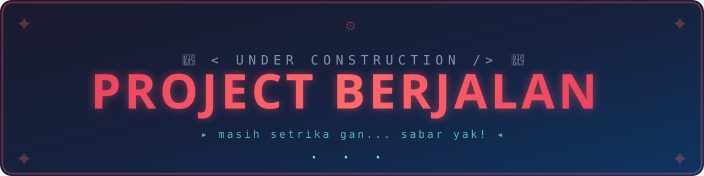

<p align="center">
  
</p>

# 🍜 Hallo Wok

> Real-time chat that snaps, crackles, and pops.

**Hallo Wok** is a modern real-time messaging app built for speed, delight, and those 3 AM conversations that need animated ring shaders.


---

## ✨ Features

| | |
|---|---|
| 💬 **Real‑time messaging** | Direct messages & group chats powered by Socket.IO |
| 👥 **Friends system** | Add friends, manage requests, see who's online |
| 🏘️ **Group chats** | Create public/private groups, manage members |
| 🎨 **Animated background** | Three.js GLSL ring shader — moves with your mouse, bursts on click |
| 🔐 **Auth** | Email/password + Google & Facebook OAuth |
| 🎭 **Profile** | Avatar, bio, status — full customization |
| ⚙️ **Settings** | General, notifications, privacy, appearance (dark mode), account |
| 📎 **File sharing** | Drag‑and‑drop uploads with react-dropzone |
| 🎬 **Animations** | Framer Motion throughout — smooth as silk |
| 🌓 **Theme** | Light / dark / system — your eyes, your rules |

---

## 🧰 Stack

**Frontend** · React 19 · TypeScript 6 · Vite 8 · Tailwind CSS 4 · React Router 7  
**State** · Zustand (client) · TanStack React Query (server)  
**Real‑time** · Socket.IO client  
**Forms** · react-hook-form + Zod  
**UI** · Framer Motion · Lucide icons · Sonner toasts  
**3D** · Three.js with custom GLSL shaders  
**DX** · Oxlint · Prettier

---

## 🚀 Quick start

```bash
# 1. Install
npm install

# 2. Set environment
cp .env.example .env
# Fill in VITE_API_URL (and OAuth keys if you want social login)

# 3. Dev
npm run dev

# 4. Build
npm run build

# 5. Preview
npm run preview
```

---

## 🧱 Project structure

```
src/
├── components/
│   ├── common/       # ThemeProvider, ProtectedRoute, MagicRings (✨), OAuthButtons
│   ├── layout/       # Sidebar, ChatList, MobileNav
│   └── ui/           # button, input, avatar, badge, skeleton
├── layouts/          # AuthLayout, AppLayout, ChatLayout, FriendsLayout …
├── pages/            # Login, Register, ChatRoom, Groups, Friends, Settings …
├── services/         # API client (axios)
├── store/            # Zustand stores
├── lib/              # utils, queryClient
├── types/            # TypeScript interfaces
└── styles/           # Tailwind globals
```

---

## 🧞 Make it yours

Every setting in `MagicRings` can be tuned — colors, speed, ring count, mouse parallax, click burst, opacity, noise. The shader runs at 60 fps even on modest hardware.

```tsx
<MagicRings
  color="#ff6b6b"
  colorTwo="#ffd93d"
  speed={1.5}
  ringCount={8}
  followMouse
  clickBurst
/>
```

---

## 📜 License

MIT — go build something rad.
